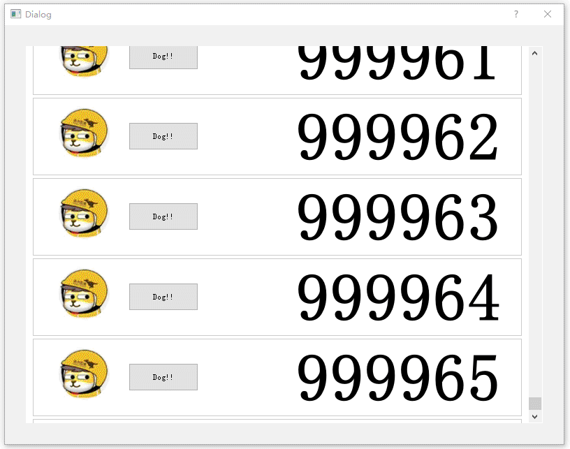

`MtRecyclerListView`是一款基于Qt框架下使用C++编写的可以容纳大量`item`的`list`控件，即使该list中包含上千万元素时，也能做到内存占用极低，CPU消耗极低，界面响应流畅。



## 技术原理
`MtRecyclerListView`的原理比较简单。
* 只创建可见区域的item，当列表发生滚动时，将滑出可见区item进行回收，滑入可见区的item从回收站中获取并复用。
* 当列表可见区域高度发生变化时，如果可见区域item增多则额外创建item，如果可见区域减少则销毁不可见的item。
* 当列表中有item插入或者删除时，重新计算可见items的个数以及每个item中显示的内容，如果出现item不足则创建新的item进行补足，如果出现item有多余则销毁。


## 特点：

`MtRecyclerListView`的特点：

1. 非常小巧，派生自QWidget，无其他依赖
2. 支持水平和垂直方向排布
3. 易于使用，采用适配器模式，需要你实现一个adapter为列表提供数据，元素大小，元素边距等信息。

## 使用

需要创建一个`MtRecyclerListView`，实现MtRecyclerListViewAdapter中的虚函数并创建一个MtRecyclerListViewAdapter实例

```cpp
MtRecyclerListView* listView = new MtRecyclerListView(this);

Adapter* adapter = new Adapter(this);
listView->setAdapter(adapter);
```

实现MtRecyclerListViewAdapter也很简单，这里有一个简单的案例：

```cpp
class Adapter: public QObject, public MtRecyclerListViewAdapter
{
    Q_OBJECT
public:
    Adapter(QObject* parent);

    // 该list按照垂直方向排列
    Qt::Orientation getOrientation() override {
        return Qt::Orientation::Vertical;
    }

    // list每个元素的大小，宽为列表宽度扣除左右margin，高为111
    virtual QSize getItemSize() override {
        QMargins m = margin();
        return QSize(m_listView->width() - m.left() - m.right(), 111);
    }

    // 元素之间间隔4个像素
    virtual int getItemSpace() override {
        return 4;
    }

    // 一共有多少个元素
    virtual int getCount() override {
        return m_items.size();
    }

    // 列表滚动区域里，上下左右留的边距是多少，
    virtual QMargins margin() override {
        return QMargins(10, 10, 30, 10);
    }

    // 创建一个元素，该元素是QWidget的派生类ListItem
    QWidget* createListItem(int index, MtRecyclerListView* parent) override {
        ListItem* item = new ListItem(parent);
        item->setPerson(index, m_items[index].name, m_items[index].age);
        return item;
    }

    // 将m_items[index]中的数据配置到item中
    void updateItem(QWidget* item, int index) override {
        ListItem* itemWidget =(ListItem*)item;
        itemWidget->setPerson(index, m_items[index].name, m_items[index].age);
    }

private:
    struct Person {
        QString name;
        QString age;
    }

public:
    QList<Person> m_items;
};
```

当插入或删除item时，需要调用`MtRecyclerListView::updateList`更新整个可见区域的item。

当某个或者某些item中的数据发生变化时，需要调用`MtRecyclerListView::updateItem`更新单个元素，也可以通过`MtRecyclerListView::updateList`更新整个可见区域的item。